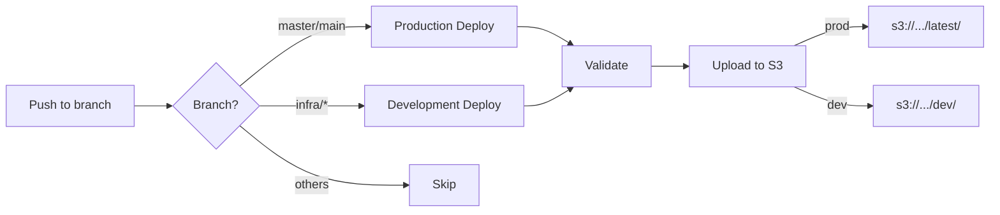

# GitHub Environments Setup Guide

このガイドでは、インフラストラクチャCI/CDのためのGitHub Environmentsの設定方法を説明します。

## 必要な設定

### 1. GitHub Secrets（Repository全体）

**Settings → Secrets and variables → Actions → Secrets**

以下のSecretsを設定してください：

| Secret名 | 説明 | 取得方法 |
|---------|------|---------|
| `AWS_ACCESS_KEY_ID` | AWS アクセスキーID | AWS IAMコンソールから取得 |
| `AWS_SECRET_ACCESS_KEY` | AWS シークレットアクセスキー | AWS IAMコンソールから取得 |
| `AWS_ACCOUNT_ID` | AWS アカウントID | `aws sts get-caller-identity --query Account --output text` |

### 2. GitHub Environments

**Settings → Environments**

#### Development Environment

1. **Environment名**: `development`
2. **Environment secrets**: なし（Repository secretsを使用）
3. **Environment variables**:
   - `AWS_REGION`: `ap-northeast-1`
4. **Protection rules**: なし
5. **Deployment branches**: 
   - Selected branches: `infra/*`, `infrastructure/*`

#### Production Environment

1. **Environment名**: `production`
2. **Environment secrets**: なし（Repository secretsを使用）
3. **Environment variables**:
   - `AWS_REGION`: `ap-northeast-1`
4. **Protection rules**:
   - ✅ Required reviewers（1人以上）
   - ✅ Dismiss stale pull request approvals when new commits are pushed
   - ⬜ Prevent self-review（オプション）
   - Deployment branches:
     - Protected branches only
5. **Deployment branches**: 
   - Protected branches: `master`, `main`

### 3. Branch Protection Rules

**Settings → Branches → Add rule**

`master`または`main`ブランチに以下の保護ルールを設定：

- ✅ Require a pull request before merging
- ✅ Require approvals (1)
- ✅ Dismiss stale pull request approvals when new commits are pushed
- ✅ Require status checks to pass before merging
  - Status checks: `validate`
- ✅ Require branches to be up to date before merging
- ✅ Include administrators（オプション）

## CI/CDワークフロー

### 自動デプロイフロー



### トリガー条件

| イベント | ブランチ | アクション | S3バージョン |
|---------|---------|-----------|-------------|
| Push | master/main | Production deploy | `latest` |
| Push | infra/* | Development deploy | `dev` |
| Pull Request | any | Validate only | `pr-{number}` |
| Manual | any | Custom deploy | 選択可能 |

## 手動デプロイ

### GitHub Actions UIから

1. **Actions** タブを開く
2. **Deploy Infrastructure Scripts** ワークフローを選択
3. **Run workflow** をクリック
4. バージョンを選択:
   - `dev`: 開発版
   - `latest`: 本番版
   - `custom`: ブランチ名-タイムスタンプ
5. **Run workflow** を実行

### GitHub CLIから

```bash
# 開発版デプロイ
gh workflow run infrastructure-deploy.yml -f version=dev

# 本番版デプロイ（要承認）
gh workflow run infrastructure-deploy.yml -f version=latest

# カスタムバージョン
gh workflow run infrastructure-deploy.yml -f version=custom
```

## セキュリティベストプラクティス

### 1. IAMポリシー

CI/CD用のIAMユーザーには最小権限の原則を適用：

```json
{
  "Version": "2012-10-17",
  "Statement": [
    {
      "Effect": "Allow",
      "Action": [
        "s3:PutObject",
        "s3:PutObjectTagging",
        "s3:GetObject",
        "s3:ListBucket",
        "s3:DeleteObject"
      ],
      "Resource": [
        "arn:aws:s3:::hametuha-infrastructure-*/*",
        "arn:aws:s3:::hametuha-infrastructure-*"
      ]
    },
    {
      "Effect": "Allow",
      "Action": [
        "cloudformation:ValidateTemplate"
      ],
      "Resource": "*"
    }
  ]
}
```

### 2. Secrets管理

- AWS認証情報は絶対にコードにハードコードしない
- 定期的にアクセスキーをローテーション
- 不要になったSecretsは即座に削除

### 3. Environment保護

- Production環境には必ずレビュー必須設定
- 自動デプロイは信頼できるブランチのみ
- デプロイ履歴の監査ログを確認

## トラブルシューティング

### デプロイが失敗する場合

1. **Secrets確認**:
   ```bash
   gh secret list
   ```

2. **権限確認**:
   ```bash
   aws sts get-caller-identity
   aws s3 ls s3://hametuha-infrastructure-${ACCOUNT_ID}/
   ```

3. **ワークフローログ確認**:
   - Actions → 失敗したワークフロー → ジョブ詳細

### S3アップロードエラー

```bash
# バケットポリシー確認
aws s3api get-bucket-policy --bucket hametuha-infrastructure-${ACCOUNT_ID}

# オブジェクトタグ確認
aws s3api get-object-tagging \
  --bucket hametuha-infrastructure-${ACCOUNT_ID} \
  --key userdata/dev/main.sh
```

## 監視とアラート

### Slack通知設定（オプション）

1. Slack Appを作成
2. Incoming Webhookを設定
3. GitHub SecretにWebhook URLを追加: `SLACK_WEBHOOK_URL`
4. ワークフローに通知ステップを追加

### デプロイメトリクス

GitHub Insightsで以下を監視：
- デプロイ頻度
- 成功率
- 平均デプロイ時間
- ロールバック頻度

## まとめ

このCI/CD設定により：
- ✅ コードプッシュで自動デプロイ
- ✅ 環境別のデプロイ管理
- ✅ プロダクション保護
- ✅ バージョン管理とロールバック
- ✅ 監査ログとトレーサビリティ

設定完了後、`infrastructure/scripts/userdata/`配下のファイルを変更してプッシュすると、自動的にS3へのデプロイが実行されます。